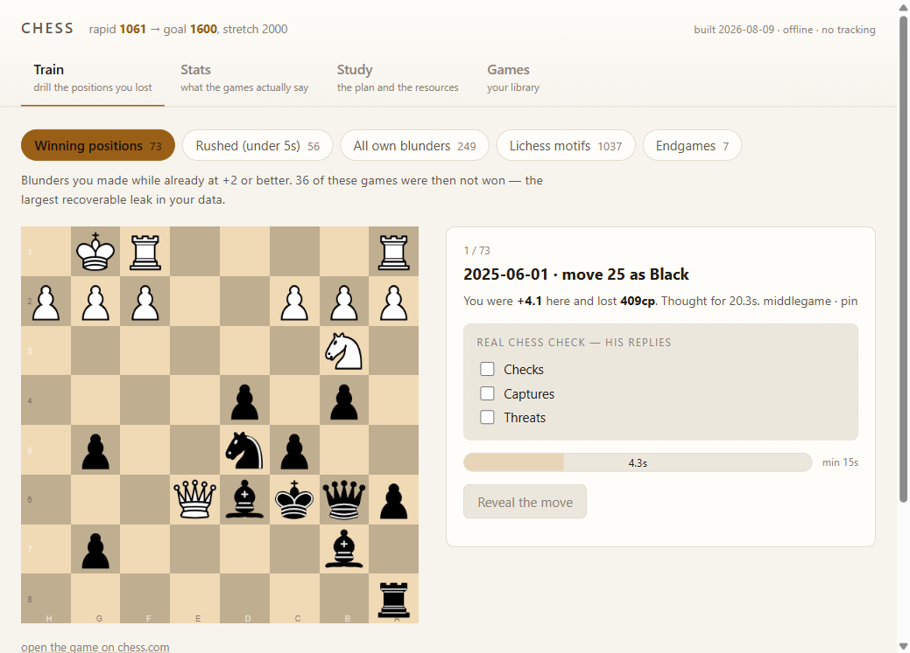
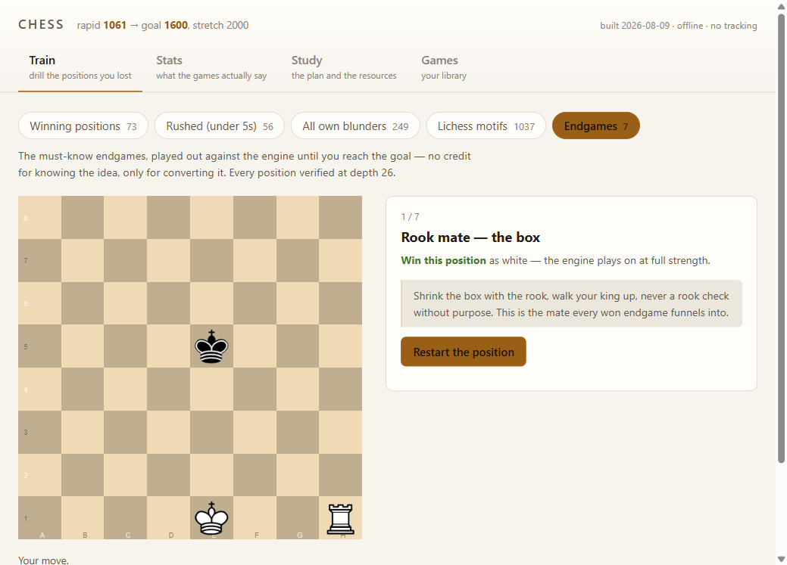
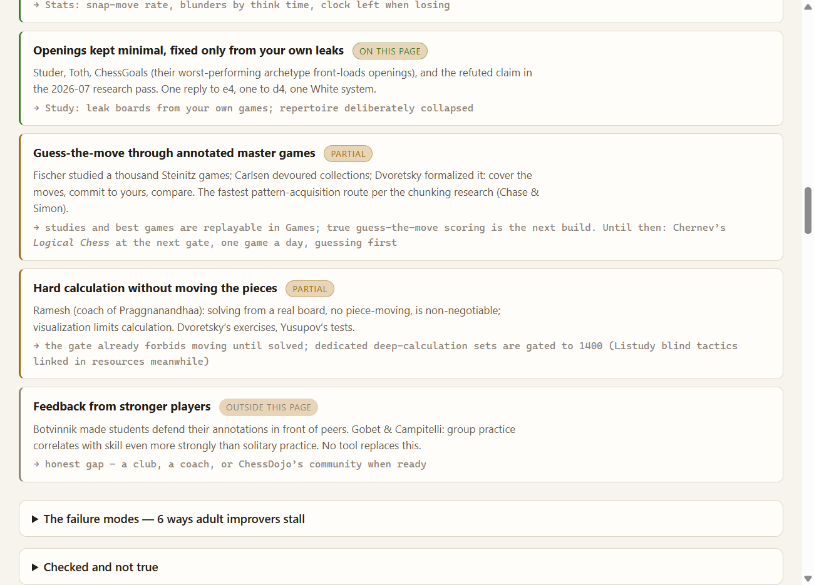
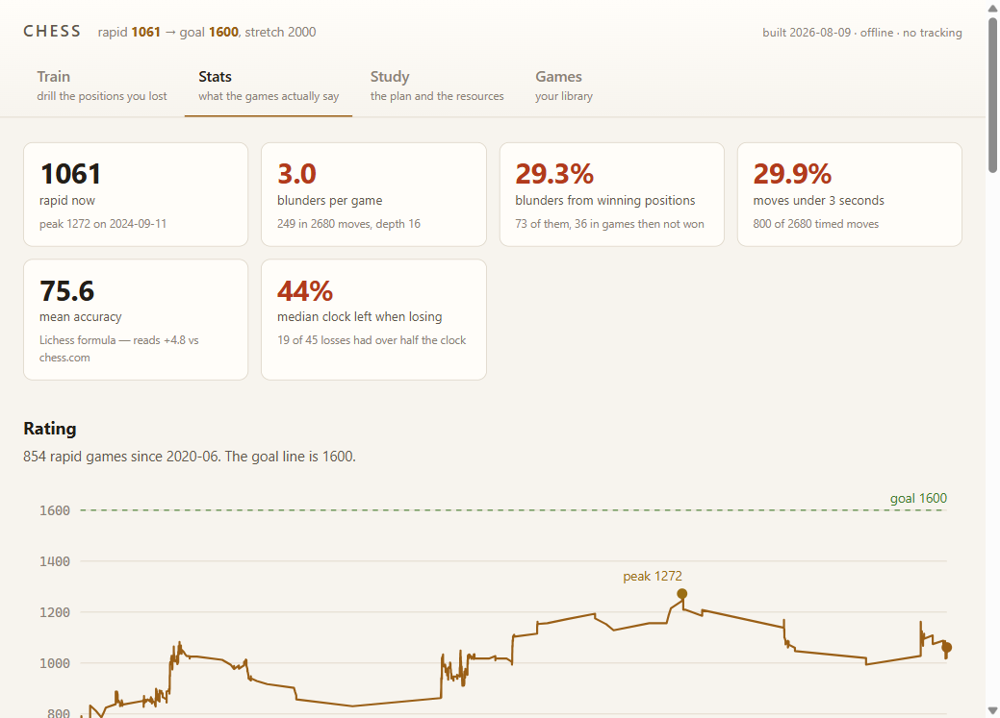

# Chess Improvement Lab

A personal, data-driven chess training system. It syncs every game from
chess.com, reviews them with Stockfish, mines the blunders for what they give
away, and compiles all of it into **one offline HTML page** that drills exactly
the positions the data says are being lost — on a spaced-repetition schedule,
behind a think-timer gate, against an embedded engine.

**Goal: 1200 → 1600, stretch 2000 (online rapid).**



## Why it looks like this

The data tells an unusual story, and the design follows it:

- Puzzle rating ~1850 against rapid 1061 — tactics are not the problem.
- 3.1 blunders per game; 78% in the middlegame; **28% from positions already
  winning**.
- 30% of moves played in under 3 seconds; median loss ends with 44% of the
  clock unused.

That is a **discipline failure, not a knowledge failure** (Heisman's "hope
chess"). So the trainer does not serve more tactics — it enforces the missing
habit: every card is locked behind a minimum think time *and* an explicit
checks-captures-threats safety check, and winning positions must be **played
out to conversion** against Stockfish.

The evidence base behind every design choice is in
[`Chess Improvement Research.md`](Chess%20Improvement%20Research.md) (adversarially
verified, 2026-07) and
[`docs/research-2026-08-what-works.md`](docs/research-2026-08-what-works.md)
(three deep-research passes: training science, tool survey, elite coaching).

## The page — `chess.html`

One self-contained 2.4 MB file. Open it from disk; it works offline, makes no
network calls, and stores nothing anywhere but your own browser.

| Tab | What it does |
| --- | --- |
| **Train** | Five decks: winning-position blunders, rushed blunders, all blunders, matched Lichess puzzles, and must-know endgames. FSRS spaced repetition; failed positions return sooner. The Real Chess gate locks every reveal. Winning positions and endgames are played out against embedded Stockfish. |
| **Stats** | Rating curve over all rapid games, blunder rate by think time and phase, move classification, clock-left-when-losing, motif table — recomputed from the JSON at build time, so it cannot drift from the reports. |
| **Study** | The evidence-ranked "what actually works" audit (with honest coverage badges), the plan as a persistent checklist, a session log against the 3.5-7 h/week band, milestone gates, the book ladder, opening leak boards, and ~40 link-checked free resources. |
| **Games** | Best games and eleven imported Lichess studies, replayable offline, plus every reviewed game in a sortable table. |





## The toolkit

Read-only against the public chess.com API — no login involved. Requires
Python 3.12+, `python -m pip install python-chess zstandard`, and a Stockfish
binary in `tools/stockfish/` ([download](https://stockfishchess.org/download/)).

| Command | What it does |
| --- | --- |
| `python tools/fetch_games.py` | Sync all games to `data/games/` (incremental) |
| `python tools/analyze.py` | Stats report → `reports/analysis.md` |
| `python tools/engine_review.py` | Stockfish review of recent rapid: accuracy, move classification, blunders |
| `python tools/puzzles.py profile` | What your blunders give away (hanging pieces, forks, pins) |
| `python tools/puzzles.py fetch` | Build a drill deck from the CC0 Lichess puzzle DB, filtered to those motifs |
| `python tools/explorer.py` | Opening tree from your own games + pool comparison |
| `python tools/build_page.py` | Rebuild `chess.html` from everything above |

Monthly ritual: run them in that order (each reads what the previous one
writes), read `reports/blunders.md`, update the progress log below.

Rebuilding the page's JavaScript is only needed if `tools/webapp/src` changes:

```sh
cd tools/webapp && npm install
npx esbuild src/app.js --bundle --format=iife --minify --target=es2022 \
    --outfile=../vendor/bundle.js
```

## Measurement notes

- **Accuracy** uses the Lichess formula, which reads **+4.8 points** higher than
  chess.com's CAPS2 on this account (measured across 14 games). Track it against
  itself, not across sites.
- **Depth matters**: below depth 14 the engine is too weak to judge you and
  accuracy inflates ~10 points. Default is depth 16; pass `d20` or a time to
  `engine_review.py`.

## Progress log

| Date | Rapid | Notes |
| --- | --- | --- |
| 2026-07-17 | ~1200 | Baseline. Goal set: 1600, stretch 2000. |
| 2026-07-26 | 1061 | Toolkit hooked up. 43% wins in 2025-26 rapid, 3.1 blunders/game; diagnosis: middlegame blunder-checking and converting won positions, not tactics. |
| 2026-08-09 | 1061 | Deep-research pass; endgame drills, evidence audit and session log added to the page; published to GitHub. |

## Licensing and credits

The repository is **GPL-3.0** — the page embeds GPL-3.0 components. Vendored,
all offline: [chessground](https://github.com/lichess-org/chessground) (GPL-3.0),
[chess.js](https://github.com/jhlywa/chess.js) (BSD-2),
[lichess pgn-viewer](https://github.com/lichess-org/pgn-viewer) (GPL-3.0),
[ts-fsrs](https://github.com/open-spaced-repetition/ts-fsrs) (MIT), and
Stockfish 10 asm.js (GPL-3.0). Puzzle data from the
[CC0 Lichess puzzle database](https://database.lichess.org/). Game data is my
own public chess.com archive. Capablanca's *Chess Fundamentals* is public
domain via Project Gutenberg.

Not tracked in git: the Stockfish analysis binary (`tools/stockfish/`,
re-download from the link above) and `node_modules`.
